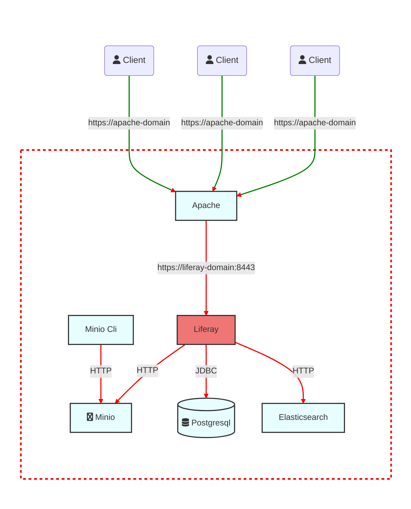

# liferay-build-image

## Architecture




## Before start your Liferay stack

### 1. You must generate certificate for Apache and Liferay with the following script
```
genApacheCertificat.sh
genLiferayCertificat.sh
```
### 2. Update the file /etc/hosts in your host machine
Append the file with the following line
```
  127.0.0.1	apache-domain
```

### 3. Compile module for Glowroot
```
compile-liferay-glowroot.sh
```

## Start the Liferay stack
```
startLiferay.sh
```


## Acces (you must /etc/hosts in host machine)
```
https://apache-domain
```

## Glowroot
### Access
- Access through `/o/glowroot`

### Users
```
admin
2022adminPWD%
```

```
glowroot
GlwRT2022!
```


## Prise en compte dans l'image Liferay (partie statique)
- Mise à jour du drivers JDBC de la base de données
- Préinstallation d'un binaire OSGI 
- Préconfiguration de properties via un fichier `portal-ext.properties`
- Création de variable d'environnement 
  - Pour la base de données, Impact des fichiers 
    - `ROOT.xml`, 
    - `setenv.sh`, 
    - `portal-ext.properties`
  - Pour Elasticsearch Impact des fichiers 
    - `com.liferay.portal.search.elasticsearch7.configuration.ElasticsearchConfiguration.config`, 
    - `setenv.sh`


## Prise en compte dans le container Liferay (partie variabilisée a valoriser en fonction de l'environnement)
- Externalisation du chemin de la GED via fichier `.config`
- Surcharge de la configuration par défaut du binaire OSGI
- Surcharge de properties via variable d'environnement fournie par Liferay 
- Création d'un fichier `.env` pour test

## HTTP2
### Activer les modules
```
LoadModule http2_module modules/mod_http2.so
LoadModule proxy_http2_module modules/mod_proxy_http2.so
```

### Define prefered protocol
```
# Prefred Protocol will be http/2
Protocols h2 http/1.1
```
### Define ProxyPass
```
ProxyPass / h2://${LIFERAY_DOMAIN}:8443/
ProxyPassReverse / https://${LIFERAY_DOMAIN}:8443
```

### Tomcat server.xml
ajout de 
```
<UpgradeProtocol className="org.apache.coyote.http2.Http2Protocol" />
```


## TODO
- tester DIM
- Hikari


## Test From Liferay container
```
curl -kv https://lbi_liferay:8443
```

```
curl https://liferay-domain:8443 -kv -o /dev/null --http2
```

## Test S3 Container
```
curl -X GET http://lbi_minio:9000/
```

## Links
https://liferay.dev/blogs/-/blogs/fronting-liferay-tomcat-with-apache-httpd-daemon-revisted
https://nm-muzi.com/docs/minio-client-complete-guide.html
